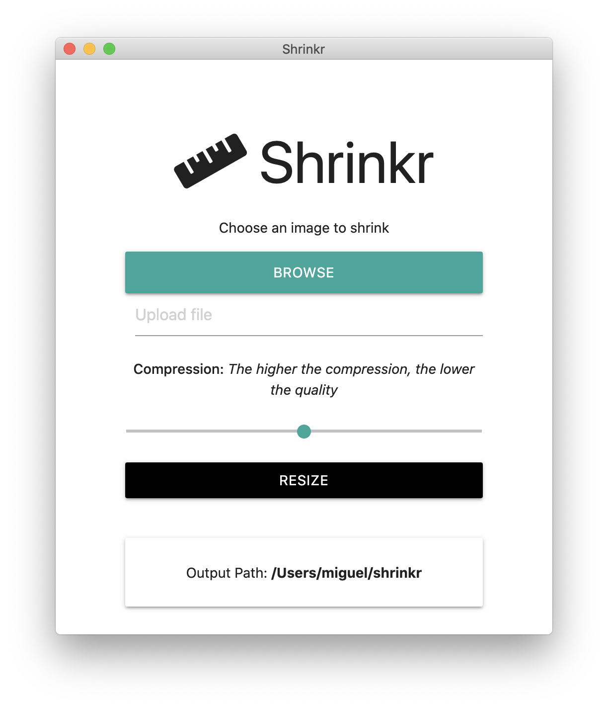

# Shrinkr



> Shrinkr is an application that is designed to help you optimize the file size of images.

## Getting Started

### Prerequisites

You will need the following software installed on your system before being able to run or package and run this application.

```
Git
NodeJS
```

### Installing

Clone this repository locally:

```
git clone https://github.com/mrivasperez/shrinkr-app.git
```

Install dependencies with npm:

```
npm install
```

Run for production:

```
npm start
```

Build release

```
macOS:
npm run package-mac

Windows:
npm run package-win

Linux:
npm run package-linux
```

## License

### The Unlicense

[](http://unlicense.org/)

## Acknowledgements

- Brad Traversy for assistance
